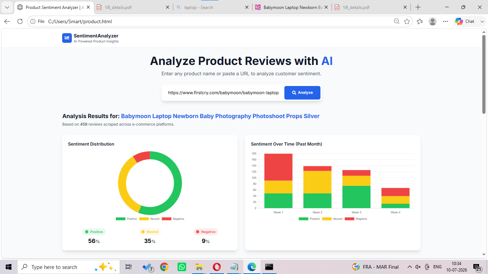
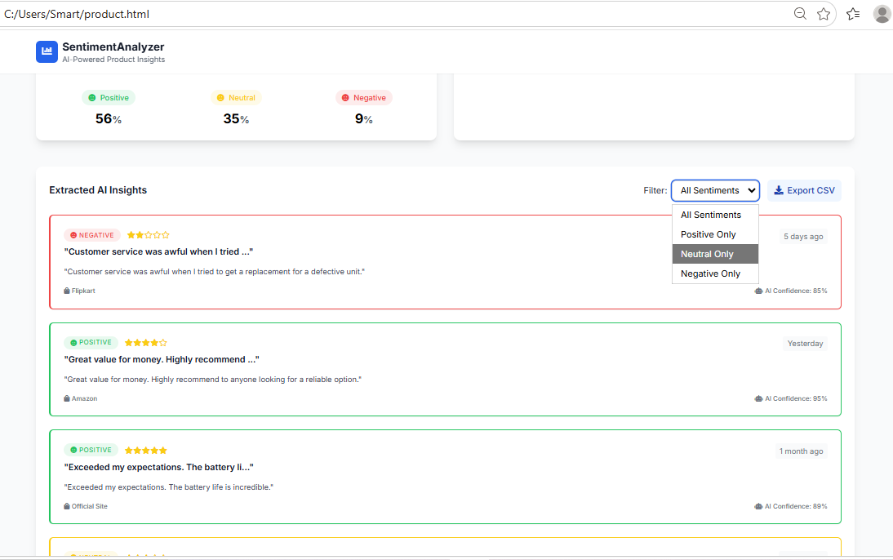

# 📊 AI-Powered Product Sentiment Analyzer

An AI-powered sentiment analysis tool. This project simulates NLP text classification to showcase dynamic data rendering and user interactions.

**Developer:** Vidhya Vinothkumar 

---

## 📸 Screenshots

**Main Dashboard & Search** 

**AI Analysis & Visualization Results** 

---

## ✨ Features

* **Intelligent URL Parsing:** Automatically extracts and formats readable product names from raw e-commerce links (e.g., Amazon, Flipkart).
* **Interactive Data Visualization:** Utilizes **Chart.js** to render dynamic Doughnut and Bar charts based on simulated data streams.
* **Real-Time Data Filtering:** Users can interactively filter the review dataset by sentiment category (Positive, Neutral, Negative).
* **Data Export (CSV):** Includes a fully functional CSV export feature to download the analyzed data.
* **Simulated Pipeline UI:** Features a dynamic progress bar that visually simulates the states of web scraping and NLP processing.

## 🛠️ Tech Stack

* **Structure:** HTML5
* **Styling:** Tailwind CSS
* **Logic:** Vanilla JavaScript (ES6+)
* **Visualizations:** Chart.js

## 🚀 How to Run

Because this is a frontend prototype, there are no databases or local servers to configure. 

1. Clone the repository:
   ```bash
   git clone [https://github.com/your-username/sentiment-analyzer.git](https://github.com/your-username/sentiment-analyzer.git)


